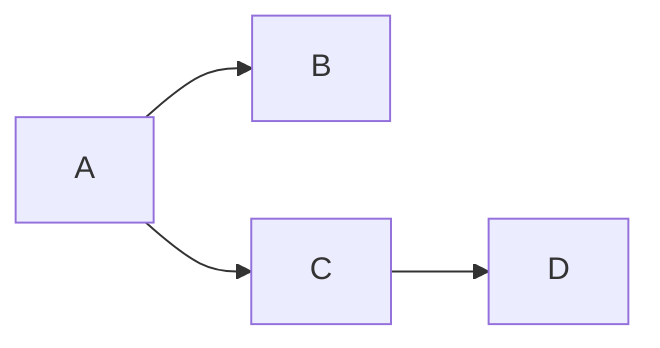

# This is my second page2

Here is a dog.

I am hoping to use mermaid in GitHub-pages, with simple commit and push.

In other words, I am hoping to wirte in my markdown file like this

```mermaid
graph LR
   A --> B
   A -->C
   C -->D
```

